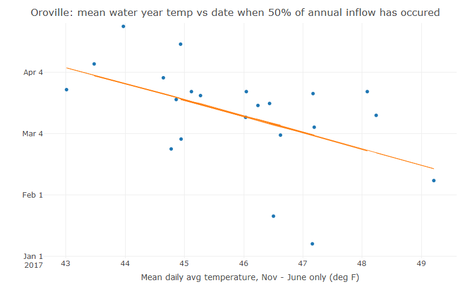

# Reservoir inflow analysis

An analysis of the effect of higher temperatures on runoff into reservoirs. Climate scientists predict that warmer temperatures will have two effects on precipitation in California:

1. More winter precipitation will fall as rain rather than snow, and will runoff into streams and reservoirs immediately rather than being stored in the snowpack
2. The snowpack that does accumulate will melt faster.

The combined result of these effects is that reservoirs will see more inflow earlier in the year. The risk of flooding from spillway damage or dam overtopping will be higher, and because reservoirs are usually kept at a lower level in the winter to leave room for flood control, water that could have been banked if received later in the year will be spilled.

Using reservoir inflow data from DWR and temperature data from CIMIS, I do a quick analysis of the effect of mean water year avg daily temperature (subsetted to Nov-Jun, the hydrologically active portion of the year) on the timing of peak reservoir inflows (defined as the julian date at which 50% of total water year inflow has occurred). Preliminary results for Oroville show that for every 1 degree increase in mean temperature during the hydrologically active part of the water year, the date of peak inflow is 5-11 days earlier (*95% C.I., p = 0.016, R2 = 0.22*). Working on results for other reservoirs.
